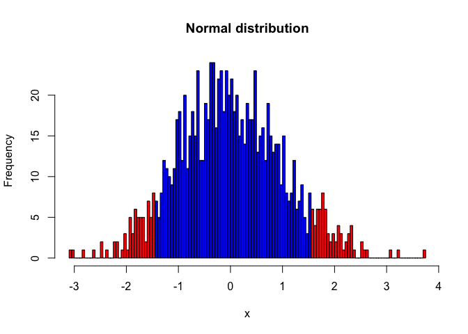

t-test
================
Sam Bogan
10/4/2021

# Summary

          The *t*-test is a simple but powerful statistical tool for evaluating differences between values measured in two groups. Like all statistical tests, it relies on assumptions about the data you are using and becomes more reliable with larger sample sizes. This walk through will describe the basic structure and application of the *t*-test before walking you through R code for (i) plotting your data for visual inspection of between-group differences, (ii) testing whether your data match the *t*-test's assumptions, and (iii) applying and analyzing the results of a *t*-test.

# What you will need

1.  The 't-test'folder that this .rmd is stored in and all of its original contents

2.  A .csv copy of your group's protist carrying capacity data, formatted exactly as you see in the Protist\_K\_Data.csv file. An empty template for your group's protist K data is included in the 't-test' folder called 'My\_Protist\_K\_Data.csv'

# What is a *t*-test?

          Say you want to pick apples from two farms, one farm with lots of water and sunshine and another in a cloudy place with poor irrigation. Since you're an Intro Bio student, you're *obviously* going to these farms with a clear and testable hypothesis in mind; if water and sunshine benefit apple growth, the farm with more sunshine and water should produce larger apples. So, you go to the farms, collect five apples from each one, and measure the mass of the apples. A *t*-test will tell you the probability that the two groups of apples you measured could have come from a single population (i.e., the same farm with the same sunshine and water). This probability is called the *p*-value. The *t*-test does this by looking at the variation within and between your two groups; how does the difference in mean apple mass between farms compare to the variation in apple within a single farm? After weighing your apples, you see that there is a noticeable difference in mean mass between farms, but your *t*-test demonstrates that there is a high probability these apples could have been drawn from the same population (*p* = 0.6; 60% chance that the measurements were drawn from a single distribution). Being the meticulous scientist you are, you recognize that your sample size may not be large enough. You go back to the two farms to collect and measure the mass of 95 more apples from each one, bringing your sample size to 200. You reapply your *t*-test to these new and improved data and *voila*, a second *t*-test determines that the mean difference between farms is unlikely to be drawn from a single distribution (*p* = 0.001; 0.01% chance).
          *t*-tests also generate a statistical parameter called *t*, the test's namesake. In essence, *t* represents the ratio of differences in a value between groups over the total variation of that value, accounting for sample size. When the absolute value of *t* is higher, discernable differences between groups are greater. The equation for calculating *t* is illustrated below. This equation corresponds to the Student's *t*-test. We will be using Welch's *t*-test in this walkthrough, the equation for Student's *t* is more easily interprettable and is included for illustrative purposes:

$$
t = \\frac{\\overline{x\_{1}}-\\overline{x\_{2}}}
{\\sqrt{(s^2(
\\frac{1}{n\_{1}} + \\frac{1}{n\_{2}}
))}}
$$
 *t* = t statistic

$\\overline{x\_{i}}$ = mean of groups 1 or 2

*s* = standard deviation of all observations

*n*<sub>*i*</sub> = sample size of groups 1 or 2

          We may not go apple picking in Intro Bio, but we have generated some nifty data that lend themselves to a *t*-test. For example, we need to compare *K* (carrying capacity) estimates between groups of protists can with and without competitors to see whether and how they are different. To apply a *t*-test to these data, let's first read it into R using the code chunk below. In these code chunks, '\#' symbol denotes a description of what each line of code is doing.

# Import dataset to R

``` r
# Read .csv file containing protist Kdata into R
Protist_K_Data <- read.csv("Protist_K_Data.csv")

# Let's look at how this data sheet is formatted
print(Protist_K_Data)
```

    ##    A_alone_K B_alone_K A_mixed_K B_mixed_K
    ## 1       3500      3680      1000      3000
    ## 2       3400      3680       800      3050
    ## 3       3300      3750      1300      3100
    ## 4       3650      3910      1150      3200
    ## 5       3600      3730      1050      2850
    ## 6       3550      3580       950      3050
    ## 7       3600      3660      1100      2950
    ## 8       3400      3730       800      2900
    ## 9       3350      3500      1100      2900
    ## 10      3450      3680       850      3050
    ## 11      3550      3910       750      3000
    ## 12      3650      3530      1050      2850
    ## 13      3550      3500       700      2800
    ## 14      3300      3830      1000      3200
    ## 15      3950      3710       750      3250
    ## 16      3450      3250       950      3250
    ## 17      3400      3680      1050      3200
    ## 18      3500      3750      1000      3000

          Looking at the 'Protist\_K\_Data' data sheet, we can see that there are 4 columns. Each column has a short but unique name. You will import your own data ('My\_Protist\_K\_Data.csv') into R later on in this walk through, which should be formatted exactly as the data sheet you see above. Next, we will plot and visually compare our K measurements between each group.

# Plotting data

``` r
## Don't worry about any of the code in this chunk
## Just look at the graph that it creates (below)

# Reformat datasheet for plotting
Plotting_Data <- rbind( data.frame(Species = "A",
                                   Mixed = "Alone",
                                   K = Protist_K_Data$A_alone_K),
                        data.frame(Species = "B",
                                   Mixed = "Alone",
                                   K = Protist_K_Data$B_alone_K),
                        data.frame(Species = "A",
                                   Mixed = "Mixed",
                                   K = Protist_K_Data$A_mixed_K),
                        data.frame(Species = "B",
                                   Mixed = "Mixed",
                                   K = Protist_K_Data$B_mixed_K))

# Create a variable combining species and treatment
Plotting_Data$Group <- as.factor(paste(Plotting_Data$Species,
                                       Plotting_Data$Mixed,
                                       sep = " "))

# Plot K values across all four treatment groups
plot(Plotting_Data$K ~ Plotting_Data$Group, main = "K across species and treatments",
     xlab = "Treatment", ylab = "K", pch = 19)
```


**Figure 1** | A box-whisker plot of *K* estimates for species by treatment. Dark black lines depict median *K*. Boxes depict upper and lower quartiles. Tails depict the minima and maxima of *K* distributions. Points depict outliers.

          It looks like there are some distinct differences among treatment groups. For example, competition seems to have a large effect on *K* in both A and B, with A exhibit the greatest reduction in *K* under in the mixed treatment (Fig. 1). We will perform a few *t*-tests to see if *K* in these groups possess significantly different means. First, we must check to see if our data meet the assumptions of a *t*-test.

# Checking for normal distribution

          *t*-tests assume several things about the nature of your data. One of these assumptions is that your data are normally distributed, meaning the histogram of frequency for *K* values exhibits a bell shaped curve with a mean and equal standard deviations in the postive and negative directions from that mean. Below is an example of a normally distributed histogram (blue) for a hypothetical value called '*x*' (Fig. 2).

``` r
## Don't worry about any of the code in this chunk
## Just look at the graph that it creates (below)

# Simulate normal and skewed distributions
norm_data <- scale(rnorm(1000))
h_norm <- hist(norm_data, breaks = 100, plot = FALSE)

# Plot the two distributions
plot(h_norm, col = ifelse(abs(h_norm$breaks) < 1.5, 4, 2), 
     main = "Normal distribution",
     xlab = "x")
```



**Figure 2** | A histogram of simulated normal data. Blue bars depidct ranges of data within the upper and lower quartiles of *x*. Red bars depict extreme ends or 'tails' of the normal distribution. One sign that these data are normally distributed is that the positive and negative tails are of equivalent ranges; extreme values are not skewed in one direction or the other.

          Not all data that you analyze will be normally distributed. Below is a histogram of simulated data that exhibit a skewed, non-normal distribution. These data would not meet the assumption of normality necessary to conduct a *t*-test (Fig. 3).

``` r
## Don't worry about any of the code in this chunk
## Just look at the graph that it creates (below)

# Simulate normal and skewed distributions
norm_skew <- scale(log(rnorm(1000)))
```

    ## Warning in log(rnorm(1000)): NaNs produced

``` r
h_skew <- hist(norm_skew, breaks = 100, plot = FALSE)

# Plot the two distributions
plot(h_skew, col = ifelse(abs(h_skew$breaks) < 1.5, 4, 2), 
     main = "Normal distribution",
     xlab = "x")
```


**Figure 3** | A histogram of simulated non-normal data. Blue bars depidct ranges of data within the upper and lower quartiles of *x*. Red bars depict extreme ends or 'tails' of the normal distribution. As these data are postiviely skewed, the negative tail of the distribution exhibits a much wider range than the positive distribution.

          Let's take at the distribution of our own data. Since there are noticeable differences between species and treatment groups, a histogram of *K* is going to look like back of a stegasaurus. We can get around this issue by 'scaling' our data, where we set the mean of each group to 0 and transform *K* into standard deviations of the mean. This may sound complicated, but it is simply a way of looking at the total distribution of data across groups with different means. After doing so, we can see that *K* appears to be normally distributed across all groups (Fig. 4)!

``` r
# Scale K data
K_scaled <- rbind( scale( Protist_K_Data$A_alone_K),
       scale( Protist_K_Data$B_alone_K),
       scale(Protist_K_Data$A_mixed_K),
       scale(Protist_K_Data$B_mixed_K))

#Plot scaled K as a histogram
hist(K_scaled,
     main = "Distribution of K",
     xlab = "K (scaled)")
```


**Figure 4** | A histogram of scaled *K* values from all species and treatment groups, meaning data were transformed such as that species and treatment group means = 0 and *K* is expressed in standard deviations from the mean.

          Looking at our data in this manner is great, and helps catch bugs or other issues with data. However, we can go beyond visual inspection and apply formal tests of normality. This cannot be done using raw data or scaled data. Rather, formal tests of normality rely on what are called "residuals": variation in a measurements that remains after explaining differences between groups do to factors (e.g., species or treatment group). We won't conduct a normality test in this walk through. If you are interested in learning about this method, please check out this excellent resource: <https://www.datanovia.com/en/lessons/normality-test-in-r/>.

# Performing the *t*-test

| Now that we know our data are normally distributed, its time to compare species and treatment groups using the *t*-test. We will use R's 't.test' function using a two sided test. Two sided tests simply allow us to ask "Is the mean of one group significantly different from the other?". By contrast, a one sided test would ask "Is the mean of this group significantly greater than the other?". The output of a two sided *t*-test contains several metrics, two of which are *t* and *p*. In essence, *t* represents the ratio of differences in a value between groups over the total variation of that value. When the absolute value of *t* is higher, discernable differences between groups are greater. The equation for calculating *t* is illustrated below. This equation corresponds to the Student's *t*-test. We will be using Welch's *t*-test, the equation for Student's *t* is more easily interprettable:
$$
t = \\frac{\\overline{x\_{1}}-\\overline{x\_{2}}}{s /\\sqrt{n}}
$$

*t* = t statistic *m* = mean of *μ* = theoretical value representing null hypothesis *s* = standard deviation of all observations *n* = sample size

          *p*, as described earlier, is the *p*-value: the probability that observations in two groups could have been drawn from a single distribution. Follow along in with the code chunks below to see how we take our data sheet (Protist\_K\_Data), input it to the 't.test' function, and interpret the results output by 't.test'.

## Comparing *K* of species cultured alone

        First we will apply a two sided *t*-test to *K* values of species A vs. B when grown alone. In plain terms, this asks "Do populations of species A and B have different carrying capacities?"

``` r
# Two sided t-test: species A vs B when cultured alone
A_vs_B_alone <- t.test(x = Protist_K_Data$A_alone_K,
                       y = Protist_K_Data$B_alone_K,
                       alternative = "two.sided",
                       mu = 0, paired = FALSE, var.equal = FALSE,
                       conf.level = 0.95)

# Print results
A_vs_B_alone
```

    ## 
    ##  Welch Two Sample t-test
    ## 
    ## data:  Protist_K_Data$A_alone_K and Protist_K_Data$B_alone_K
    ## t = -3.0929, df = 33.991, p-value = 0.003946
    ## alternative hypothesis: true difference in means is not equal to 0
    ## 95 percent confidence interval:
    ##  -267.89383  -55.43951
    ## sample estimates:
    ## mean of x mean of y 
    ##  3508.333  3670.000

        As you can see, differences between *K*<sub>*A*</sub> and *K*<sub>*B*</sub> when cultured under unmixed conditions (*K*<sub>*A*<sub>*U*</sub></sub> and *K*<sub>*B*<sub>*U*</sub></sub>) correspond to a *t*-value of -3.09 and a a *p*-value of 0.004, meaning there is a significant difference in *K* between species when cultured alone with a 0.4% chance that these differences could have randomly sampled from a single distribution.

## Comparing *K* of species A in mixed and unmixed cultures

        We can also apply a *t*-test to compare the distributions *K*<sub>*A*<sub>*M*</sub></sub> and *K*<sub>*A*<sub>*U*</sub></sub>, the carrying capacities of species A under mixed and unmixed conditions.

``` r
# Two sided t-test: species A, alone vs. mixed
Mixed_vs_Alone_A <- t.test(x = Protist_K_Data$A_alone_K,
                       y = Protist_K_Data$A_mixed_K,
                       alternative = "two.sided",
                       mu = 0, paired = FALSE, var.equal = FALSE,
                       conf.level = 0.95)

# Print results
Mixed_vs_Alone_A
```

    ## 
    ##  Welch Two Sample t-test
    ## 
    ## data:  Protist_K_Data$A_alone_K and Protist_K_Data$A_mixed_K
    ## t = 48.27, df = 33.964, p-value < 2.2e-16
    ## alternative hypothesis: true difference in means is not equal to 0
    ## 95 percent confidence interval:
    ##  2437.314 2651.575
    ## sample estimates:
    ## mean of x mean of y 
    ## 3508.3333  963.8889

        Differences in *K*<sub>*A*<sub>*M*</sub></sub> and *K*<sub>*A*<sub>*U*</sub></sub> are much larger than what we observed between *K*<sub>*A*<sub>*U*</sub></sub> and *K*<sub>*B*<sub>*U*</sub></sub> (*t* = 48.27). Furthermore, there is almost no chance that our observations of *K*<sub>*A*<sub>*M*</sub></sub> and *K*<sub>*A*<sub>*U*</sub></sub> were drawn from the sample population/distribution (*p* &lt; 2.2e-16). If we hypothesized that the carrying capacity of species A is influenced by competition with species B, these results provide strong support to reject our null hypothesis.

## Apply t-test to your own data

        **THIS SECTION IS NOT YET COMPLETE** It will contain one code chunk that reads in data, plots their mean differences and distribution, and generates results for one t-test.

``` r
# Here is the code chunk where students will analyze their own data.

# I will write out the code and generate this same markdown file with it in the final version, but the output will be removed from the document. Students will be able to run this chunk on their own in R studio.
```
